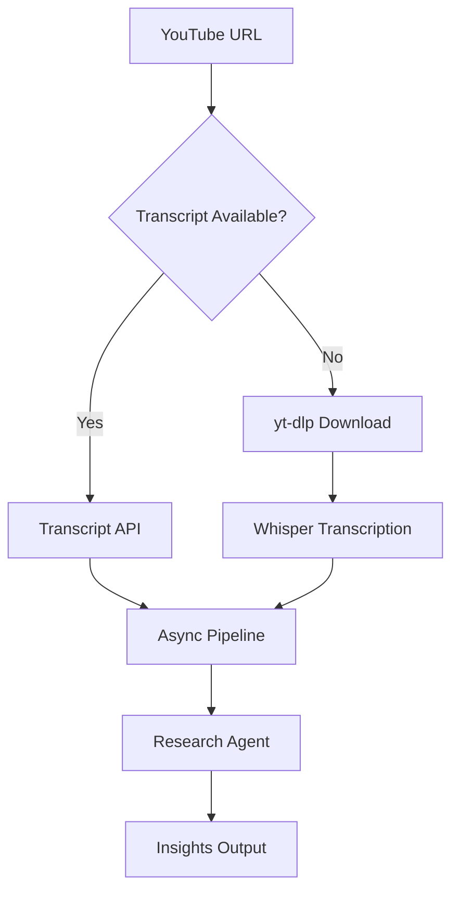

# 🎥 YouTube AI Research Agent


AI-powered multi-agent system to extract structured insights from YouTube videos using **Transcript API + Whisper fallback + Async pipeline**.

---

# 🚀 Overview

This project implements a **production-style AI pipeline** that:

* Extracts transcripts from YouTube videos
* Falls back to **Whisper** when subtitles are unavailable
* Processes data asynchronously (non-blocking)
* Uses **CrewAI multi-agent system** to generate insights

---

# 🧠 Key Features

* ✅ Transcript-first (fast & efficient)
* 🎙️ Whisper fallback (robust)
* ⚡ Async pipeline (scalable)
* 🤖 Multi-agent system (CrewAI)
* 📊 Structured insights output
* ✍️ Blog-ready content generation

---

# 🏗️ Architecture



---

# 📂 Project Structure (Updated)

```bash
CrewAI/
│
├── agents/
│   └── agents.py          # Define AI agents (researcher, writer)
│
├── tasks/
│   └── tasks.py           # Task definitions & Crew orchestration
│
├── utils/
│   └── youtube_pipeline.py # Transcript + Whisper async pipeline
│
├── crew.py                # Crew setup (agents + tasks binding)
├── tools.py               # Custom tools (YouTube, etc.)
├── main.py                # Entry point
│
├── README.md
└── requirements.txt
```

---

# ⚙️ Installation

```bash
git clone https://github.com/Npppsss/youtube-ai-research-agent.git
cd youtube-ai-research-agent
```

```bash
python -m venv venv
source venv/bin/activate
# Windows:
venv\Scripts\activate
```

```bash
pip install -r requirements.txt
```

---

# ▶️ Usage

```bash
python main.py
```

---

# 🔄 Pipeline Flow

1. Input YouTube URL
2. Check transcript:

   * If available → use directly
   * If not → download audio → Whisper
3. Process transcript asynchronously
4. Send to CrewAI:

   * Research Agent → extract insights
   * (Optional) Writer Agent → generate blog

---

# ⚙️ Core Modules

## 🔹 `youtube_pipeline.py`

Handles:

* Transcript fetching
* Audio download (yt-dlp)
* Whisper transcription
* Async execution

## 🔹 `agents.py`

Defines:

* Video Researcher Agent
* Blog Writer Agent

## 🔹 `tasks.py`

Handles:

* Task creation
* Input injection
* Crew execution

## 🔹 `crew.py`

* Connects agents + tasks
* Orchestrates workflow

---

# 🚀 Performance Optimization

* Use `faster-whisper` for speed
* Use `asyncio` for concurrency
* Cache transcripts to reduce cost
* Batch process multiple videos

---

# ⚠️ Limitations

* Whisper is resource-heavy
* yt-dlp may rate-limit
* No transcript if:

  * Private video
  * Subtitle disabled

---

# 🔮 Future Improvements

* [ ] FastAPI deployment
* [ ] Docker support
* [ ] Vector DB (RAG)
* [ ] Frontend dashboard
* [ ] Cloud deployment (AWS/GCP)

---

# 📌 Author

Novandra
AI Engineer | ML | Backend Systems

---

# ⭐ Final Note

This project showcases **real-world AI engineering**, combining:

* Intelligent fallback systems
* Async processing
* Multi-agent orchestration

---
